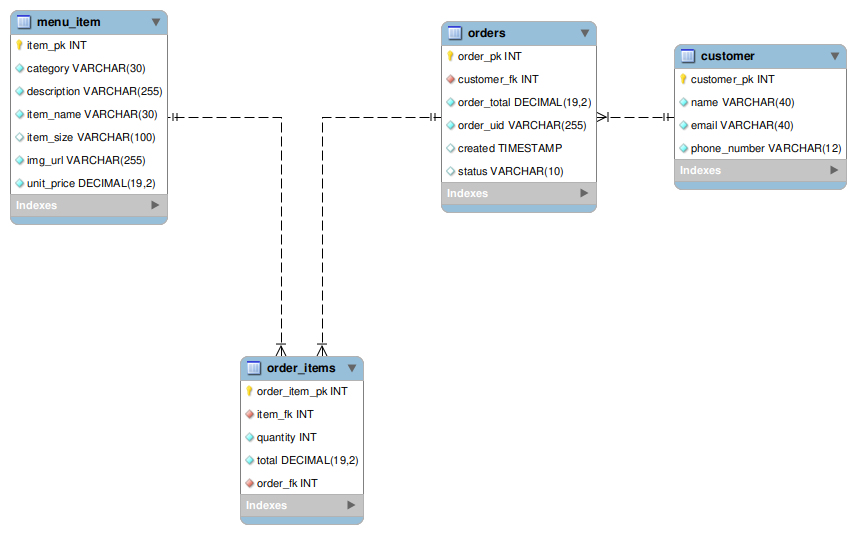
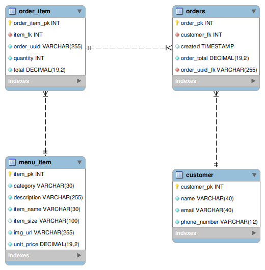
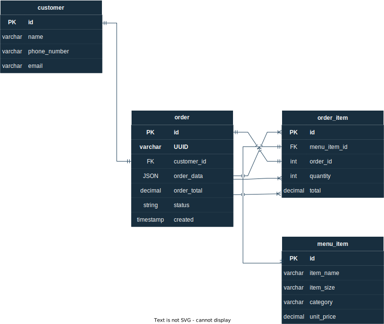

## This Journal tracks development progress, ideas and thoughts.

---

-- 30 Mar 2023 --

- Broke out owners-tools controllers and services to owners-tools/orders and owners-tools/customers.
- Further testing demonstrated an error in calculating daily sales.
  - Refactored DB from status column to closed column in order to replicate function of ready column. ie(default no and then when changed logs time).
  - Refactored method in orders repository to find order by closed.
  - Refactored close order method in OwnersOrdersService and daily sales method.
  - Updated logic of daily sales to reflect changes.
    - Test successful.
- Base test uris updated for owner functions relating to customers.
- Customer test classes created.
- Successful test for deleting a customer from db.
- Successful test for getting all customers.
- Successful test for get customer by id.
- Successful test for update customer name.
- Successful test for update customer email.
- Successful test for update customer email.

- Discovered assertThat() not necessarily allowing tests to fail. Dove into the Assertions class for solutions and appear to have rectified the past issue.

### Initial tests for owners functions pertaining to customers in place!

---

-- 29 Mar 2023 --

- Successful test for getting an order by id.
- Successful test for deleting an order by id.
- Functionality for owner to add a menu item to an order implemented.
- Functionality for owner to edit an item on an order implemented.
- Successful test for editing an item on an order.
- Successful test for adding an item to an order.
- Successful test for returning days sales and verifying the equal a summed total of orders
  marked closed in the db.

### Initial tests for owners functions pertaining to orders in place!

---

-- 28 Mar 2023 --

- Added verification clause to order created test by immediately retrieving the created order from db.
- Successful test for owners to retrieve an order by order uid.
- Successful test for owners to get all orders.
- Successful test for retrieving open orders by customer name.
- Successful test for marking an order ready.
- Successful test for marking an or order closed.
- Test case for marking an order closed exposed a bug where orders were unable to be called after being marked closed.
  As customer id field was null the requirements were unfilled for creating the necessary dto. This was fixed by setting a default null value for the
  fields of interest. If the incoming order has null for a customer id then there is no point in setting the fields and the requirements of the dto are satisfied.

---

-- 27 Mar 2023 --

- Determined means for obfuscating customer details.
- More time spent researching hashing data for owner auth will work on it more after initial tests successful with restructure.
- Refactored reflecting structure change and removed unnecessary tests though their frames may be utilized in future contexts.
- Menu item tests successful
- Order creation test successful.

---

=======

-- 21 Mar 2023 --

- Customer and order saved in same transaction.
- Customer may place an additional order while past order is still open, eliminating duplicate customer entries.
- Upon closing last open customer order, customer information removed. Ensures information not in use is not sitting idly waiting to be exploited.
- Began work on securing owners tools endpoint.
  - Created owners table and loaded sample data.
  - Created owner entity and respository.

---

=======

-- 20 Mar 2023 --

- Get customer dto refactored for the desired use case and function is currently operating as desired.
- Implemeneted returning a customer by customer name.
- Implemented returning a customer by id.
- Implemented updating a customers details.
- Implement customer delete a customer without deleting orders associated to them so that information can still be used for accounting purposes.

- Refactor notes:

  - Removed unused code and comments app wide due to relocation of functionality between order item, orders and owners.
  - Relocated order item dto converter to orders service.

- Began combining order and customer dto into a new order dto that more closely reflects what the order object will consist of.

- refactor notes
  → removed unused code and comments app wide due to relocation of functionality between order item, orders and owners
  → relocated order item dto converter to orders service

  =======

  -- 17 Mar 2023 --

- Get customer dto refactored for the desired use case and function is currently operating as desired.
- Implemeneted returning a customer by customer name.
- Implemented returning a customer by id.
- Implemented updating a customers details.
- Implement customer delete a customer without deleting orders associated to
  them so that information can still be used for accounting purposes.

---

-- 16 Mar 2023 --

- Return order by uid for owners implemented.
- Return open order by customer for owners implemented.
- Get the days sales migrated to owners endpoint.
- Mark an order ready migrated to owners endpoint.
- Ability to delete an order by id migrated to owners endpoint.

---

-- 15 Mar 2023 --

- Controllers restructured to share the orders endpoint.
- Order can be edited to add an order item and order total is adjusted.
- Order item can be edited to change quantity and order item total and order total is adjusted.
  - If quantity = 0 the item is removed from order and the order total is adjusted.
- Functions reduced from order item controller as they are now implemented through orders controller
- Began creating packages for functions specific to owners, ie returning entities instead of DTOs so that they are able to have ease in manipulating data.
- Created owners controller, service, and dto layers.
- Implemented owners getting all orders in conjunction with their customized dto.

---

-- 14 Mar 2023 --

- Implemented sales endpoint which tallies number of completed sales and total for the current day for owners use.
- Implemented deletion of an order.

---

-- 13 Mar 2023 --

- Return order by uid implemented.
- Create order now correctly generates totals.
- Restructured get-order endpoint to be searchable by uid or customer name.
- Return order by customer name implemented.
- Order able to be marked with a time ready.
- Order status can be marked closed to indicate an order is complete.

---

-- 9 Mar 2023 --

- Status column added to orders.
- New erd available.
- Json syntax for creating order figured.
- Initial test for creating an order successful.
- Ready column added to orders.
- get orders returned to working off of dto, stills needs to be cleaned.
- New erd available.

  

---

-- 8 Mar 2023 --

- Setting up dto for order response. Interested to see if this will solve recursion as we will be wanting to work with dto most likely anyways.
- Dto implemented and relationships currently behaving as expected.
- Next steps will include implementing tests, and reformatting database to include a column for status with a default value of open, and to be changed manually to closed after customer pays and picks up food by tons of tacos owners. May need to also include field for contact details but they will be encrypted. To be worked on at a later date.
- test sql scripts updated
- Initial Test for all orders returned successful.

---

-- 7 Mar 2023 --

- Checkout endpoint initial implementation successful.
- Changing cart implementation to be conducted from front end and lighten server load. Not that this app should be undergoing a heavy rush but logic and research seems to suggest this is the way.
- SQL scripts updated.
- Refactor implemented.
- Initial test for getting all orders and their associated values through postman successful.
- Will get a new erd up soon.

---

-- 6 Mar 2023 --

- Branch schema changed where I will just stay on a branch for all work pertaining to in lieu of jumping back and forth to tests and end points branch. Please note development there has stopped and is continued on other branches.
- orders controller interface implemented.
- orders dto created.
- created packages and initial files for orders tests
- first function for endpoint currently operating as intended.

- Initial files for orders created.

---

-- 5 Mar 2023 --

- Updated order item entity to cart item as it better describes the purpose.
- Order controller interface implemented with swagger for documentation.
- Branch schema changed where I will just stay on a branch for all work pertaining to in lieu of jumping back and forth to tests and end points branch. Please note development there has stopped and is continued on other branches.

---

-- 3 Mar 2023 --

- Remove cart item tests successful.
- Create order item no longer returns the item added to cart in a response so that selected items remained cloaked. May be overkill or create other issues down the road. If so check there.
- Console messages created for verification of reaching service, controller and action completed.
- Order item tests functioning as designed.
- Code reformatted, cleaned up and ready to start working on orders.

---

-- 2 Mar 2023 --

- Successful tests for utilizing dto to return list of order items with 200 and
  if uuid not valid returning 404.
- Created dto for returning order items with specified parameters, tests successful.
- Updating cart tests successful.
- Composite indexes may be the key to what I was originally envisioning for link between order items and order item. Will take much more research and time.
- The two previously mentioned tables are no longer linked and sql scripts have been altered.

---

-- 28 Feb 2023 --

- initial order item response formatted.
- test with dto successful and good data for cart successful.
- test with dto and bad data for add to cart successful.
- total is now auto generated when an order item is created based on order items base price and the quantity selected.

---

-- 27 Feb 2023 --

- Now using HSQLDB as in memory for testing, way to many issues with H2 being restrictive and not truly modeling database.
- All tests successfully functioned from returned non linked entities.
- Established succesful relationship between order items and menu items with jpa.
  Still lots of work to be done formatting the data.
- Began Implementaion of dto for order items. New tests to be written as progress made.

---

-- 23 Feb 2023 --

- Successful test that order item is deleted with a 200 status code
  and cannot be deleted again because it can not be found because it has been deleted.
- Successful test for order item not deleted if order item id invalid.
- Implemented deleting an order item if if quantity is zero and tests verify desired functionality.
- Re-instantiated orders and customer entities.

---

-- 22 Feb 2023 --

- Get order items by uuid completed including handling bad input.
- Restored update quantity function to service and controller.
- Restored delete order item function to service and controller.
- Created successful test order item quantity is updated as well as order item total.
- Created successful test to return 404 if order item does not exist.

---

-- 21 Feb 2023 --

- Revised create Order Item tests to produce desired and satisfactory results for successful and unsuccessful scenarios.
- Began structuring tests for getting order items through a common uuid.

---

-- 20 Feb 2023 --

- Working through customer and order endpoint correlation, logic, and encryption.

---

-- 16 Feb 2023 --

- initial logic of testing if all order item fields are valid completed.
- need to possibly redefine test order item through a builder instead of json string values.
- right now cant compare as the database is in memory and closes after writing to the db so trying to read if value is valid against the repository is mute.
- need to refine regular expressions and test again after return from break.

---

-- 15 Feb 2023 --

- completed test for returning menu items by category.
- properties files split out between application and test.
- tests for successful call of menu items by category and unsuccessful call created.
- documentation updated.
- began piecing order endpoint back together including testing operation for a successful addition to a cart.

---

-- 14 Feb 2023 --

- Getting menu items by id tests completed and began organizing tests for getting menu items by category.
- Documentation to follow.

---

-- 13 Feb 2023 --

- Test environment refactored for full function of in memory h2 in order to preserve db image.

- Menu item endpoint restored and tested for calling a menu item by id number successfully. Will test for a 404 and 400 next.

---

-- 10 Feb 2023 --

- test env config restored.
- connections and base endpoint functionality re-established.
- turned off default exposure through config file.
- menu controller back online.
- order controller back online.
- all endpoints functioning as desired.
- tested in browser and postman.
- next will be error handler integration and unit testing for each endpoint and feature.
- updated erd below. Clockwise cascade.

  &nbsp;

  

## &nbsp;

-- 9 Feb 2023 --

- Initial refactor complete. Means for adding a new order item to the database restored. Meaning that it should be feasible to create a cart. From the front end.
- Test environment scripts need to be restored however as they appear to be belly up at this point. Lots learned through the process.
- Also created new erd that represents changes. Will work on getting it up tomorrow.

---

-- 8 Feb 2023 --

- Started coming across abnormalities while conducting tests and so spent the day refactoring. Hoping the end result is for the better.

---

-- 7 Feb 2023 --

- DB refactored. Table 'order_item' is now 'cart' as this better reflects its purpose.
- Initial completion of update quantity of a cart item. Also updates the total.
- Initial completion of remove cart item. Needs some refactoring to reflect the new schema but methods were all tested and functioning in the browser and posted before changes made.
- Full crud functions for cart!

Lots to do still but starting to see light. Updated to do list.

---

-- 6 Feb 2023 --

- Refactored order item controllers and services.
- Refactored packages for organizational purposes.
- Began working out logic for updating a menu item.
- Updated documentation for menu item and order item controllers.
- Will be refactoring data structure in future. Order items will become cart items as this is more descriptive of what is actually happening.
- Order item endpoints test in browser and with postman for desired functionality. Tests will be written with JUnit following establishment of remaining endpoints for crud functionality of cart items.

---

-- 3 Feb 2023 --

- Refactored menu item controllers and created services that now provides desired functionality of shorthand or jpa search.
  -Refactored Controller naming convention .
- Working on functionality of order/cart item in regards to crud operations and then transferring to an order with making these end points open for queries. Will resume next week.

---

-- 2 Feb 2023 --

- added jira project - need to research issue keys.
- updated read me to include purpose of application and link to dev journal.
- created endpoint for creating orders and order items.
- created test for 201 response upon successful creation of order item.
- tested endpoint with valid data in postman.
- cleaned up tests.
- created controller and documentation for order endpoint.
- cleaned up config file.

Tomorrow's goals

- Refactor Controllers.
- Continue Crud Operations for order items.

---

-- 1 Feb 2023 --

- Built global error handler for future implementation.
- Began fleshing out functionality to be associated with adding items to a cart.
  - In summary:
    - click on item >> order uuid is generated >> relevant information is written to DB for the purpose of populating a cart for customer to alter and observe.
    - On checkout >> uuid and cart will clear after using the data in the cart to create an order and write to DB.
- Created order item controllers and repository classes.
- Refactored database based on needs new phase will bring.
- Update project on GitHub.

Tomorrow's goals

- Start project management with Jira.
- Update README description.
- Begin work on controllers and and tests to facilitate writing order items to DB.

---

-- 31 Jan 2023 --

- Test built for creating a new menu item for when that feature is implemented for the owners.
- Test built for getting menu items by category.
- Sprint concluded on target.

Tomorrow's goals

- Build error handler.

---

-- 30 Jan 2023 --

- Re-organizing menu item test for http responses.
- Organizing ideas on migrating menu item to order item.

---

-- 27 Jan 2023 --
Not as far as I wanted to get today but I'll take the small victory.

- Created test for retrieving data and comparing it against an expected set of data.
- Also tested for proper response code from the query.

---

-- 26 Jan 2023 --

- Created a configuration that works for testing in memory as well as against the actual database.
- Successfully created a test to create a new item in the database. I am not completely pleased with it however and intend to do some more work on it. Right now we create an entity to send through a constructor but I would like for the data to come from a builder instead.

Tomorrow's goals

- Try and complete means for full crud testing with in memory database.

---

-- 25 Jan 2023 --

- Revealed entity ids in order to aid in ease of working with data with method constructed in rest config
- Refined test for CRUD operations against the data base.
- Calling items by category will remain as simply a query on our menu-item endpoint.
- Considerable research into configuring H2 in memory database for testing purposes. Have possibly locked on to a configuration that will yield desired results.

Tomorrow's goals

- Try and complete means for full crud testing with in memory database.

---

-- 24 Jan 2023 --

Starting to get a bit more dialed with my procedure and what needs to come next. The pieces are falling together. I do find that I am prone to losing time because I worry about best practice and simply questioning if I'm doing this right in order to save work down the road. But sometimes you just gotta fool about and find out ^\_-.

- Created resources for searching menu items by id and category.
- Refined swagger document a bit more
- Created test file working with menu items by category
- Refined menu item path a bit so that a bit more precision is required to call an item and all items do not just become available upon endpoint entry.
- Updated DB with columns for descriptions and image urls.
- Added more DB entries to work with.

Tomorrow's goals

- More work on menu item category endpoint.
- Work on menu item test and error handling.
- Possibly work on logging.

---

-- 23 Jan 2023 --

- Created successful route test for a menu item.
- Created API documentation with swagger for menu-item end point.
- Added as project on github and linked to repository. Don't know how well I'll be able to keep up with project tracking while simultaneously developing application solo but going to give it a try.

Tomorrow's goals

- Create and Test menu-item endpoint for returning items by category.
- Add documentation for end point.
- Update DB to add columns 'description' and 'img-url' to menu-item table.
- Begin work on error handling.

---

-- 19 Jan 2023 --

- Inserted test data to local instance db.
- Created connection configuration.
- Created base entity classes.
- Created Menu Item repository as part of dao.
- Created Data Rest Config and limited access to read only.
- Tested endpoint in browser and with Postman.
- Created basic test classes.
- Updated README with a rough phase list.

Next tasks will include fleshing out the test classes. Project management with github and jira.

---

-- 18 Jan 2023 --

- Created script based on an updated EDR.
- Established local database for testing.
- Initialized SpringBoot application.
- Created base packages for further development.

---

-- 17 Jan 2023 --

Created initial EDR for consideration of database layout. This diagram will be updated as improvements are made.

&nbsp;

  

&nbsp;

---

-- 16 Jan 2023 --

Created repositories, updated readme and pushed all to readme-update branch.

---

© Adam Straub 2023
